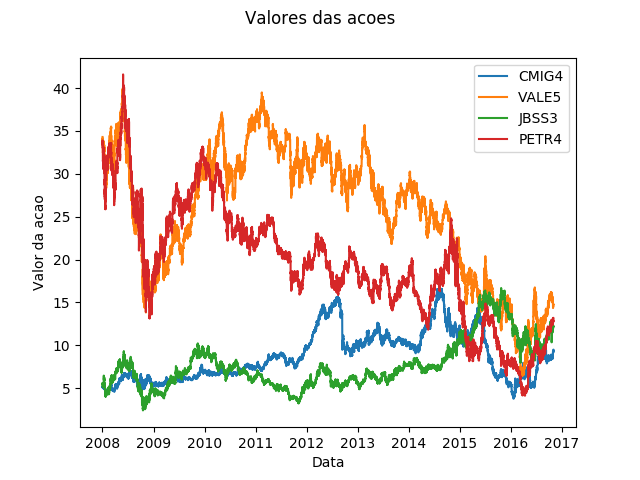

# Stock Market Prediction Based on Machine Learning Algorithms
My final project in the paper Machine Learning (Universidade Federal de Minas Gerais).

## Introduction

Stock market prediction is a challeging task since the stock marked is not based only in financial factors and rational decisions, but also in decisions based on emotions. Thus, there is a lot of uncertainty and noise in financial time series data which makes hard good predictions. However, considering that humans repeat behaviours, there is a great potential in aplying Machine Learning in this area.

Considering that there are several forces that moves stocks prices such as company news, politics, supply and demand, especulations and even natural disasters, it's reasonable to assume that some forces affect only a subset of socks and that there are forces unique to a stock. Therefore, this project uses a [Suport Vector Machine (SVM)](https://en.wikipedia.org/wiki/Support_vector_machine) as a machine learning classifier to evaluate the classification accuracy of stocks market data when (1) applyied to datasets composed by a single stock, and (2) combined with financial technical indicators.

## Dataset

> The data was provided by a third party and I have asked permission to publish a limited subset from a stock but, unfortunately, I had no response yet.

The original dataset is composed by 60 stocks from [BM&F BOVESPA](https://en.wikipedia.org/wiki/BM%26F_Bovespa), the Brazilian oficial stock exchange and the 13th largest in the world (in 2011). The data was crawled in a 15 minutes interval between BOVESPA's opening and closing times from January 2008 to March 2017, where each stock is represented by around 70000 entries. The following image illustrates 4 stocks from this dataset:

