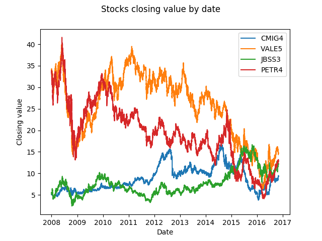

# Stock Market Prediction Based on Machine Learning Algorithms
My final project in the paper Machine Learning (Universidade Federal de Minas Gerais).

## Table of Contents

* [Introduction](#introduction)
* [Dataset](#dataset)
* [Hypothesis](#hypothesis)
* [Experiments and Results](#experiments-and-results)
* [Future Work](#future-work)

## Introduction

Stock market prediction is a challenging task since the stock market is not based only in financial factors and rational decisions, but also in decisions based on emotions. Thus, there is a lot of uncertainty and noise in financial time series data which makes hard good predictions. However, considering that humans repeat behaviours, there is a great potential in applying Machine Learning in this area.

Considering that there are several forces that moves stocks prices such as company news, politics, supply and demand, speculations and even natural disasters, it's reasonable to assume that some forces affect only a subset of socks and that there are forces unique to a stock. Therefore, this project uses a [Support Vector Machine (SVM)](https://en.wikipedia.org/wiki/Support_vector_machine) as a machine learning classifier to evaluate the classification accuracy of stocks market data when (1) applied to datasets composed by a single stock, and (2) combined with financial technical indicators.

## Dataset

> The data was provided by a third party and I have asked permission to publish a limited subset of it but, unfortunately, I had no response yet.

The original dataset is composed by 60 stocks from [BM&F BOVESPA](https://en.wikipedia.org/wiki/BM%26F_Bovespa), the Brazilian official stock exchange and the 13th largest in the world (in 2011). The data was crawled in a 15 minutes interval between BOVESPA's opening and closing times from January 2008 to March 2017, where each stock is represented by around 70000 entries. The following image illustrates 4 stocks from this dataset:

Every row from the dataset is described by the following features:

| **Feature** | **Description**                          |
|:-----------:|:----------------------------------------:|
| **Open**    | Stock opening value at this day          |
| **Close**   | Stock closing value at time *t*          |
| **Minimum** | Stock minimum value until time *t*       |
| **Maximum** | Stock maximum value until time *t*       |
| **Volume**  | Transaction financial volume at time *t* |

At last, for every input *x* at the time *t*, *x(t)* was classified as **up** (or **1**) if *x*'s closing value at *t + 1* was higher than at *t* and **down** (or **0**) if the opposite.

## Hypothesis

| H1: A stock is affected by a set of forces *unique to it*. |
|:-----------------------------------------------------------|

In order to verify this hypothesis, the original dataset was split into datasets composed by only one stock, which were trained and tested separately. To limit the project scope, the following stocks were selected from the original dataset:

| **Code** | **Company**                                  |
|:--------:|:--------------------------------------------:|
| BBCD4    | Banco Bradesco                               |
| ABEV3    | Companhia de Bebidas das Américas (AmBev)    |
| CMIG4    | Companhia Energética de Minas Gerais (CEMIG) |
| VALE5    | VALE S.A.                                    |
| BRFS3    |  Brasil Foods S.A.                           |
| JBSS3    |  JBS S.A.                                    |
| BRKM5    |  Braskem S.A.                                |
| PETR4    |  Petróleo Brasileiro S.A. - Petrobras        |
| BBAS3    |  Banco do Brasil S.A.                        |
| NATU3    |  Natura Cosméticos S.A.                      |
| CCRO3    |  Companhia de Concessões Rodoviárias         |

---

| H2: Financial technical indicators highly correlated to a stock closing value *affect positively* in the *classification accuracy*. |
|:----------------------------------------------------------------|

To test this hypothesis, the financial technical indicators of each stock dataset were calculated using the external library [TA-Lib (Technical Analysis Library)](http://www.ta-lib.org/). Then, each dataset was split into 3 new datasets, were the features were composed by:

* **First dataset:** the technical indicators highly correlated to the stock closing value plus the original features;
* **Second dataset:** the indicators lowly correlated plus the original features;
* **Last dataset:** only by the original features.

Note that the correlation was calculated using the [Pearson correlation coefficient (PCC)](https://en.wikipedia.org/wiki/Pearson_correlation_coefficient), which was considered **high** when the coefficient was **higher or equal than +-0.5** AND **low when the opposite**.

## Experiments and Results

The following experiments used an implementation of SVM from the [Scikit Learn](http://scikit-learn.org/stable/), a Python Machine Learning framework. The parameters used to train the SVM for all datasets were fixed to *C = 1*, *Radius Basis Function kernel* and the others [SVM default parameters](http://scikit-learn.org/stable/modules/generated/sklearn.svm.SVC.html#sklearn.svm.SVC). As it can be show by the table below, the accuracy is noticeably high for some stocks - considering the accuracies of [57.831%](http://www.sciencedirect.com/science/article/pii/S0925231203003722) and [61.7328%](https://www.researchgate.net/profile/Kumkum_Garg2/publication/238747905_A_Hybrid_Machine_Learning_System_for_Stock_Market_Forecasting/links/00b7d53b4cfc215d81000000/A-Hybrid-Machine-Learning-System-for-Stock-Market-Forecasting.pdf) obtained in the literature using SVMs for this problem - and there is a considerable amplitude of accuracy for the datasets - where the maximum difference is of 7.1% -, all of which **supports the hypothesis H1**. 

| Code  | Avg Accuracy (%) | Variance |
|:-----:|:----------------:|:--------:|
| BBCD4 | **57.4**         | 0.57     |
| ABEV3 | **60.1**         | 0.88     |
| CMIG4 | **61.6**         | 0.69     |
| VALE5 | 55.6             | 0.13     |
| BRFS3 | 54.2             | 0.32     |
| JBSS3 | **59.3**         | 0.45     |
| BRKM5 | 56.9             | 0.43     |
| PETR4 | 55.7             | 0.13     |
| BBAS3 | 56.1             | 0.15     |
| NATU3 | 54.0             | 0.09     |
| CCRO3 | **59.3**         | 0.68     |

As for hypothesis H2, it was verified that the selection of financial technical indicators based on its correlation changed for each stock. However, the accuracy results for all stock's 3 datasets were the same and thus **H2 could not be validated**. Since the weights in a SVM are composed by the formula below, it is possible that the variables *c(i)* for the technical indicators are zero and, therefore, H2 must be tested for **another machine learning algorithm**.

## Future Work

* Improve the classification accuracy by investigating the optimal SVM parameters;
* H2 validation: replication of this study for other machine learning algorithms;
* Investigate the possible reasons/forces which cause differences in stocks classification accuracy;
* Predict the value profit in buying/selling stocks instead of predict ups and downs.
